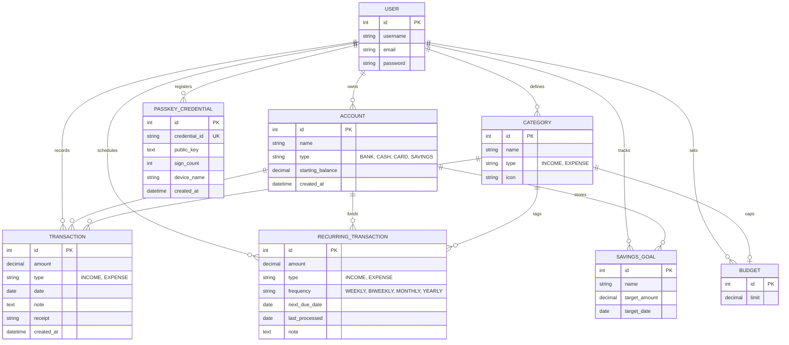

# 💸 SpendWise — Autonomous Financial Engine & Predictive Runway

> **Portfolio Project — Designed & Engineered by a Computer Engineering Student**  
> An executive-grade personal finance operating system engineered with **Django 6.1**, **Tailwind CSS v4**, **Vanilla ES6+ JavaScript**, and **W3C WebAuthn (FIDO2) Hardware Biometrics**.

[](https://python.org)
[](https://djangoproject.com)
[](https://tailwindcss.com)
[](https://fidoalliance.org)
[](https://web.dev/progressive-web-apps/)
[-brightgreen?style=flat&logo=pytest&logoColor=white)]()

---

## 📌 Executive Summary & Engineering Motivation

As a **Computer Engineering student**, managing irregular cash flows, tech investments (laptops, servers, cloud credits), tuition milestones, and peer-shared expenses highlighted a major gap in existing financial software: **most apps are glorified digital receipts with zero forward-looking intelligence, no hardware security, and bloated third-party dependencies**.

**SpendWise** was engineered from the ground up as a zero-compromise financial operating system. It merges rigorous software engineering principles with fintech capabilities:
1. **Mathematical Precision**: Replaced IEEE 754 floating-point inaccuracies with Python `Decimal` fixed-point arithmetic throughout all ledger balances and aggregations.
2. **Hardware-Anchored Security**: Integrated W3C WebAuthn Level 3 (FIDO2) for hardware biometric passkeys (Windows Hello, Touch ID, Face ID), eliminating password credential theft.
3. **Predictive Analytics**: Implemented a forward-looking cash flow runway model and a dynamic "Safe-to-Spend" daily envelope calculator.
4. **Zero-Bloat Vanilla UI**: Handcrafted responsive SVG area/donut charts and interactive UI flows without relying on heavy chart or component libraries, achieving sub-millisecond rendering speeds and offline PWA capability.

---

## 🏛️ System Architecture

SpendWise is structured as a modular Django application with clean separation between relational data modeling, asynchronous AJAX controllers, client-side progressive enhancement, and static pipeline bundling.

```
SpendWise Architecture
├── WebAuthn / FIDO2 Authenticator (Hardware TPM / Touch ID / Windows Hello)
│       └── Cryptographic Challenge & Signature Verification (RP ID: localhost)
├── Presentation Layer (Tailwind CSS v4 + Vanilla JS + PWA Service Worker)
│   ├── Global Command Palette (⌘K / Ctrl+K Spotlight Bar)
│   ├── One-Click Privacy Mode (Non-destructive CSS Blur Engine)
│   ├── Interactive Slide-Over Ledger Drawer & Split Bill Modal
│   ├── Dynamic SVG Financial Charts (6-Month Trend & Predictive Runway)
│   └── Embedded AI Financial Copilot (Contextual Natural Language Assistant)
├── Application Layer (Django 6.1 MTV Architecture)
│   ├── Strict User-Scoped Mixins (Insecure Direct Object Reference Defense)
│   ├── Sliding-Window IP Rate Limiter (Brute-Force Attack Mitigation)
│   ├── Formula Injection-Proof CSV & JSON Audit Serialization
│   └── Dynamic Category Reassignment on Cascade Deletions
└── Data Layer (SQLite in Development / PostgreSQL in Production)
    └── 8 Normalized Relational Entities with Atomic Transactions
```

---

## ⚡ Complete Feature Matrix & Capabilities

### 1. 🎛️ Global Command Palette (`⌘K` / `Ctrl+K`)
- Floating spotlight interface accessible anywhere with `Cmd + K` or `Ctrl + K`.
- Keyboard-first navigation: jump between Ledger, Envelopes, Predictive Runway, Reports, and Account Settings without touching the mouse.
- Quick actions: Launch the Bill Splitter, toggle Privacy Mode, trigger Quick Add (`N`), or view shortcut cheatsheets (`?`).

### 2. 🏦 Unified Multi-Account & Multi-Currency Ledger
- Aggregate bank accounts, petty cash wallets, virtual credit cards, and locked savings vaults in a consolidated net worth view.
- Real-time live multi-currency converter supporting **NGN (₦)**, **USD ($)**, **GBP (£)**, and **EUR (€)**.
- Full support for historical baselines, starting balances, and color tags.

### 3. 🎯 Smart Budget Envelopes & "Safe-to-Spend" Dial
- **Safe-to-Spend Engine**: Dynamically calculates exact daily spend limits:
  $$\text{Daily Allowance} = \frac{\text{Current Envelope Balance} - \text{Scheduled Recurring Bills}}{\text{Days Remaining in Cycle}}$$
- **Historical 30-Day Insight**: Contextual helper card showing exact past 30-day spend when configuring budget envelopes.
- **Envelope Controls**: Configurable rollover balances and automated alert threshold badges (70%, 80%, 90%, 100%).

### 4. 📊 Predictive Cash Flow Runway
- Forward-looking financial runway forecasting analyzing trailing 90-day outflow velocity against liquid cash reserves.
- Custom smooth curved SVG gradient area charts projecting net financial trajectory 3 to 6 months into the future.
- Visual burn-rate indicators alerting the user when projected outlays threaten their safety runway.

### 5. 🧾 Intelligent Transaction Ledger & Slide-Over Drawer
- **Click-to-Inspect Drawer**: Clicking any ledger entry slides open a detailed transaction drawer from the right screen edge.
- **Live Inline Updates**: Edit transaction note, category, account, or amount in real-time with instant AJAX patch verification.
- **Intelligent Subtitles**: Automatically displays merchant/note as the primary title with clean subtext formatting (`Oct 2, 2026 · Main Checking · Groceries`) without repeating categories.
- **Sanitized Deletion**: One-click asynchronous deletion with optimistic DOM removal.

### 6. 🤝 Interactive Bill Splitting & Shared IOUs
- Split shared dinner checks, housing rent, or utility bills with customizable tip percentages and participant counts.
- **1-Click WhatsApp Export**: Formats a clean, copyable summary ready to send into group chats.
- **Ledger IOU Integration**: Adjusts the parent transaction down to the user's personal share and automatically records the balance as an active claim under `"IOU & Reimbursements"`.

### 7. 🔐 WebAuthn / Passkey Biometric Hardware Authentication
- Full implementation of the **W3C WebAuthn Level 3 (FIDO2)** protocol.
- Users authenticate using hardware biometrics (Windows Hello, Touch ID, Face ID, or YubiKeys).
- Zero shared secrets: the server validates public key cryptographic challenge-response signatures and checks monotonic `sign_count` counters to eliminate replay attacks.
- Robust numeric IP resolution handling domain negotiation between `127.0.0.1` and `localhost` in `DEBUG` environments.

### 8. 🤖 Embedded AI Financial Copilot
- Intelligent in-app financial assistant trained on personal budgeting, engineering expenses, and personal finance rules.
- **Capabilities**:
  - **Dynamic Calculations**: Parses queries like *"If I save ₦30,000 for 8 months"* into real-time compounding projection tables.
  - **50/30/20 Rule Analysis**: Tailors advice for students, developers, and young professionals.
  - **Tech Investment Reviews**: Analyzes purchases (MacBooks, monitors, servers) with amortization advice.
  - **Debt Payoff & Splitting**: Explains debt snowball methods, IOU tracking, and inflation hedging strategies.
  - **System Navigation**: Explains all shortcuts, passkey setup, and export tools.

### 9. 👁️ One-Click Privacy Mode (`Ctrl + P` / Eye Toggle)
- Non-destructive client-side privacy shield applying `filter: blur(8px)` across all `.currency-val` elements.
- State persists in `localStorage` with inline boot scripts to prevent content flash during page loads.
- Perfect for working in university libraries, cafes, or presenting over screen shares.

### 10. 📸 OCR Receipt Scanner
- Upload receipt photos or PDFs to automatically extract merchant name, transaction date, and total amount.
- 1-click transition from scanned receipt into a pre-filled transaction form.

### 11. 🔁 Recurring Commitments & Subscriptions
- Auto-tracking for subscriptions (Netflix, Spotify, Starlink), quarterly bills, and annual rent.
- Real-time commitment calculator projecting annualized obligations (e.g. `₦25,000/mo = ₦300,000/yr total commitment`).
- Visual upcoming bill radar with warnings 3 days prior to due dates.

### 12. 🔒 Savings Vaults & Milestone Pacing
- Create dedicated goal vaults (Emergency Buffer, Tech Gear, Rent, Investments).
- Quick preset target chips (`3 Months`, `6 Months`, `End of Year`).
- Real-time pace projector calculating required monthly and weekly contributions.

### 13. 🛡️ Data Sovereignty & Audit Tools
- **Sanitized CSV Export**: Automatically escapes dangerous formula characters (`=`, `+`, `-`, `@`) to protect against Excel CSV injection attacks.
- **Full JSON Backup**: One-click complete database export of all models.
- **CSV Bank Statement Importer**: Upload statements with automated malformed row skipping and validation error logs.

---

## 🗄️ Database Schema & Data Models



---

## 🛡️ Security & Defensive Engineering

| Threat Vector | Mitigation Strategy Implemented in SpendWise |
|---|---|
| **Insecure Direct Object Reference (IDOR)** | Custom `UserOwnedMixin` strictly scopes every database query (`filter(user=request.user)`). Cross-user access returns an immediate HTTP 404. |
| **Formula Injection (CSV Injection)** | `escape_csv_formula()` prepends a single quote `'` to any cell starting with `=`, `+`, `-`, or `@` prior to CSV generation. |
| **Credential Phishing & Replay** | W3C WebAuthn public-key authentication ensures private keys never leave client hardware; monotonic signature counters reject cloned assertions. |
| **Data Cascade Deletion** | Deleting a category automatically cascades past transactions into an `"Uncategorised"` category instead of wiping financial history. |
| **Brute Force & Rate Exhaustion** | Sliding-window cache rate limiters throttle authentication endpoints (login capped at 10 requests / 5 mins; signups at 5 / hour). |
| **Floating-Point Imprecision** | All currency operations strictly enforce Python `Decimal` fixed-point representations up to 12 digits and 2 decimal places. |
| **Public Balance Peeking** | One-Click Privacy Mode non-destructively masks sensitive balances using hardware-accelerated CSS blurring. |

---

## 🛠️ Technology Stack

| Layer | Technologies |
|---|---|
| **Backend Framework** | Python 3.12, Django 6.1.1 (MTV Pattern) |
| **Database** | SQLite (Development) / PostgreSQL via `dj-database-url` (Production) |
| **Frontend Styling** | Tailwind CSS v4.3 (JIT CLI compiler, custom `@theme` palette) |
| **Frontend Scripting** | Vanilla ES6+ JavaScript (Zero chart libraries, zero jQuery, pure DOM APIs) |
| **Authentication** | Django Auth (PBKDF2-SHA256) + W3C WebAuthn / FIDO2 Hardware Biometrics |
| **Static Assets** | WhiteNoise with custom Lenient Compressed Manifest Storage |
| **Offline & PWA** | Web App Manifest (`manifest.webmanifest`) + Caching Service Worker (`sw.js`) |

---

## 🚀 Getting Started & Local Setup

### Prerequisites
- **Python 3.10+** (Tested on Python 3.12)
- **Node.js 18+** & **npm** (For Tailwind CSS v4 compiler)
- **Git**

### Installation

1. **Clone the Repository**:
   ```bash
   git clone https://github.com/your-username/spendwise.git
   cd spendwise
   ```

2. **Set Up Python Virtual Environment**:
   ```bash
   # Windows
   python -m venv venv
   .\venv\Scripts\activate

   # macOS / Linux
   python3 -m venv venv
   source venv/bin/activate
   ```

3. **Install Dependencies**:
   ```bash
   pip install -r requirements.txt
   npm install
   ```

4. **Run Migrations & Compile Assets**:
   ```bash
   python manage.py migrate
   npm run build
   python manage.py collectstatic --noinput
   ```

5. **Seed Demo Data**:
   Populate the database with realistic demo accounts, categories, transactions, budgets, and goals:
   ```bash
   python manage.py seed_demo
   ```
   > **Demo Credentials**:
   > - **Username**: `demo`
   > - **Password**: `demo12345`

6. **Launch the Development Server**:
   ```bash
   python manage.py runserver
   ```
   Open your browser to: **`http://localhost:8000`** (or `http://127.0.0.1:8000`).

---

## 🧪 Automated Testing & Verification

SpendWise features comprehensive unit and integration tests covering ownership isolation, decimal arithmetic precision, budget threshold detection, recurring schedule processing, CSV formula escaping, malformed statement recovery, and category deletion fallbacks:

```bash
python manage.py test
```

**Test Suite Coverage**:
- `test_ownership_isolation`: Ensures users cannot access another user's accounts, transactions, or budgets.
- `test_decimal_math_correctness`: Verifies currency math eliminates floating-point rounding errors.
- `test_budget_limit_detection`: Validates budget overflow calculation logic.
- `test_recurring_transaction_generation`: Confirms frequency intervals and schedule rules.
- `test_csv_export_escaping`: Proves injection formula cells (`=CMD()`, `@SUM()`) are neutralized.
- `test_csv_import_malformed_rows`: Tests robust error skipping on dirty CSV bank statements.
- `test_category_deletion_fallback`: Validates auto-reassignment to `"Uncategorised"`.

---

## ⌨️ Keyboard Shortcuts Reference

| Shortcut | Action |
|---|---|
| `⌘K` / `Ctrl + K` | Open Global Command Palette |
| `Ctrl + P` | Toggle One-Click Privacy Mode (Blur Balances) |
| `N` | Quick Add New Transaction |
| `?` | Open Keyboard Shortcuts Cheat Sheet |
| `Esc` | Close Any Modal, Drawer, or Palette |

---

## 👨‍💻 Engineering Author & Portfolio Notes

**SpendWise** was conceived, architected, and built by a **Computer Engineering student** passionate about building robust, high-performance distributed systems, cryptographic security, and human-centric software.

Key engineering takeaways demonstrated in this project:
- **Zero-Dependency Frontend**: Writing high-performance charting, math, and UI interactivity in Vanilla JS rather than outsourcing basic browser capabilities to multi-megabyte npm dependencies.
- **Hardware-Software Interface**: Bridging browser Web APIs with hardware biometrics (TPMs, Touch ID, Windows Hello) via W3C WebAuthn.
- **Defensive API & Database Design**: Protecting against IDOR, SQL injection, formula injection, and denial-of-service through strict architectural guardrails.

---

## 📄 License
This project is open-source and available under the [MIT License](LICENSE).
